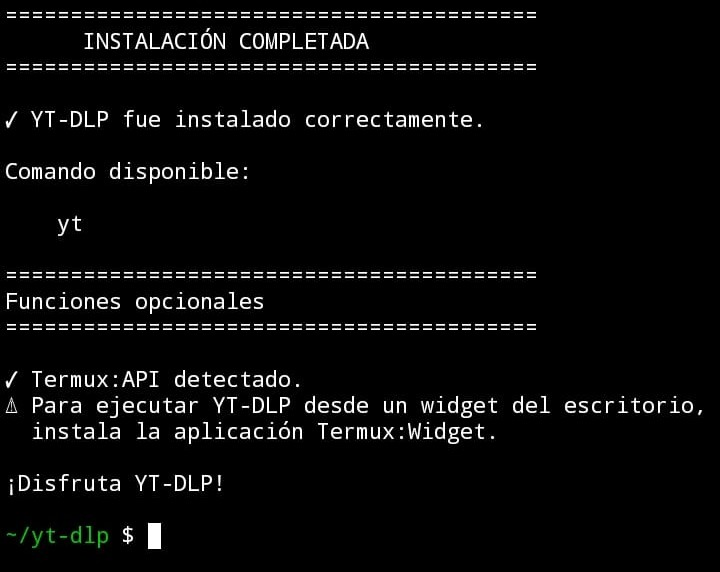

# YT-DLP PARA ANDROID

## Captura



Una interfaz interactiva para **yt-dlp** diseñada para **Termux** en Android.

## Características

- 📹 Descargar videos.
- 🎵 Descargar audio en MP3.
- 📋 Ver formatos disponibles.
- 🔄 Actualizar yt-dlp.
- 📱 Compatible con Termux.
- ⚡ Instalación automática.

## Requisitos

- Termux
- Termux:API (opcional, para notificaciones y vibración)
- Termux:Widget (opcional, para ejecutar desde un widget)

## Instalación

## Primero instalamos git

```bash
pkg install git
```

## Ahora clonamos el repositorio

```bash
git clone https://github.com/dan85jg/yt-dlp.git
```

## Entramos a la carpeta creada en el celular

```bash
cd yt-dlp
```

## Le damos permisos al instalador

```bash
chmod +x installer/install.sh
```

## Ejecutamos el instalador

```bash
./installer/install.sh
```

## Uso

Después de instalar, ejecutar en la consala de Termux (si se instalo Termux:widget se puede agregar el acceso directo al celular y omitir este paso siempre):

```bash
yt
```

## Estructura del proyecto

```
yt-dlp/
├── installer/
│   └── install.sh
├── scripts/
│   ├── yt
│   ├── banner.sh
│   ├── check.sh
│   ├── download.sh
│   ├── audio.sh
│   ├── formats.sh
│   ├── update.sh
│   └── utils.sh
└── README.md
```

## Licencia

Proyecto de código abierto bajo licencia MIT.


**Este trabajo fue echo con ayuda de IA**
